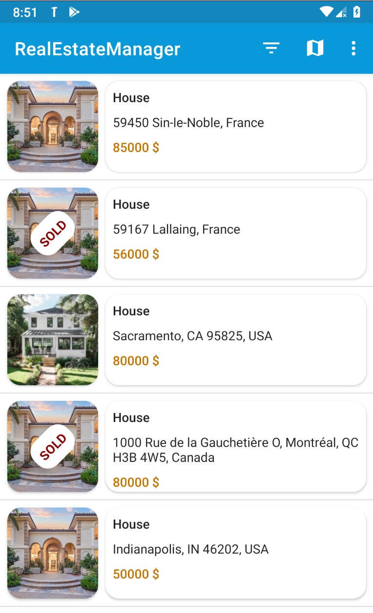
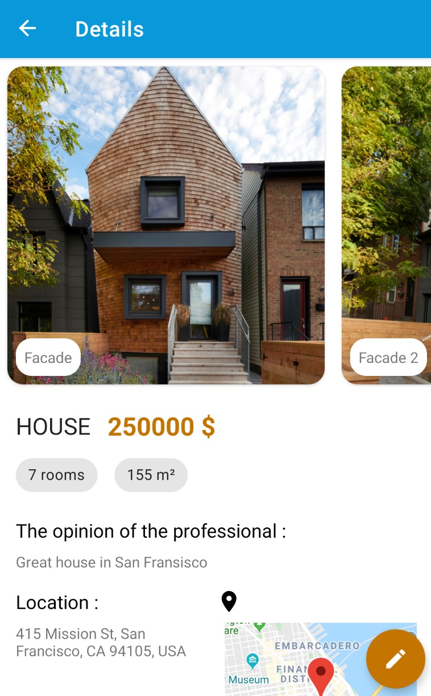
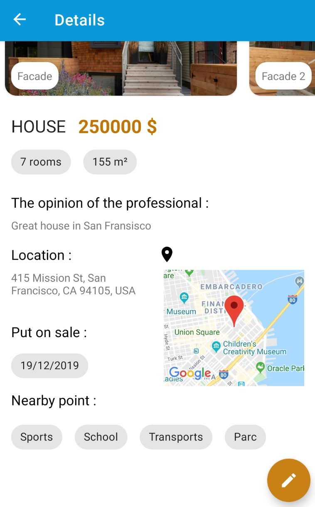

# RealEstateManager

An android application that allows the management of real estate.

This allows:
- register a property on a SQL database
- view the properties in the form of a list or on a map
- filter the list of properties with numerous criteria in order to reduce the number on the list and on the map
- convert the price into euro
- perform a loan simulation

## Phone display:
### Main screen

### Details

 

## Tablet display:
### Main screen

## Library
- Navigation Component
- Data Binding, LiveData and ViewModel (Architecture Component)
- Room
- Junit
- Espresso
- Material Design

## API
- Map sdk Android
- Place sdk Android 

### Developed By LEFEBVRE Thomas

    Copyright 2019 TEKZ Dev

